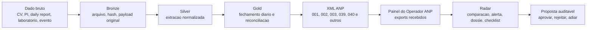

# Radar ANP - Plano mestre operacional

Data de referencia: 2026-07-03

Este documento consolida a visao do Painel do Operador como um sistema inteligente de medicao, conformidade e auditoria regulatoria. O objetivo e rastrear o fluxo completo da informacao de producao enviada a ANP, desde o dado bruto de origem ate o XML transmitido e o dado recebido no Painel do Operador.

## Objetivo

O Radar ANP deve responder, com evidencia rastreavel:

- qual dado foi gerado na origem;
- qual regra transformou esse dado;
- qual XML foi enviado;
- o que a ANP recebeu no Painel do Operador;
- quais divergencias, prazos, limites, documentos ou analises estao pendentes;
- qual evidencia sustenta cada alerta, recomendacao ou proposta de ajuste.

## Principios de operacao

- A base de dados local e o ponto de consolidacao. Arquivos de origem nunca devem ser sobrescritos pelo Radar.
- Toda extracao deve guardar caminho, hash quando disponivel, data de leitura, parser, versao da regra e payload original.
- A IA deve atuar primeiro em modo leitura e explicacao. Escrita, copia, baixa, movimento de arquivo ou atualizacao cadastral so pode ocorrer por proposta rastreavel e aprovacao humana.
- Comparacoes entre unidades diferentes, como m3 e t, exigem regra explicita de conversao, densidade ou fator aplicavel antes de gerar delta conclusivo.
- Alertas devem mostrar causa provavel, evidencia usada, lacuna de dado e recomendacao.
- Dados carregados manualmente devem seguir o mesmo contrato dos dados extraidos automaticamente.

## Fluxo end-to-end

## Dominios de dados

| Dominio | Exemplos | Uso no Radar |
| --- | --- | --- |
| Normas e matriz regulatoria | resolucoes, manuais, guias, matriz SGM | requisitos, prazos, periodicidade, obrigatoriedade e base normativa |
| Cadastro de medicao | ponto, tag, fluido, medidor, computador de vazao, PAM, faixas | dossie do ponto, validacao tecnica e rotas de calculo |
| Dados brutos | CV Run_Daily, PI/CSV, daily reports, MPFM/SEP | origem da medicao e fechamento diario |
| XMLs enviados | familias fiscais e tecnicas, pacotes ZIP | prova de envio e estrutura regulatoria transmitida |
| Painel Operador ANP | exports XLSX recebidos | confirmacao do que a ANP recebeu e reconciliacao |
| Falhas e eventos | falha de medicao, alarmes, mudanca de parametro | prazo, justificativa, evidencia e divergencia |
| Analises fisico-quimicas | densidade, cromatografia, PVT, BSW | consistencia de parametros usados em medicao |
| Calibracao e incerteza | certificados, relatorios, planilhas, validade | limites, faixa calibrada, incerteza diaria e vencimentos |
| Auditoria e propostas | alertas, decisoes, baixa de pendencia | governanca e trilha de aprovacao |

## Modulos funcionais

### Dashboard end-to-end

- Visao raw -> processamento -> XML -> Painel ANP.
- Medicoes diarias por ponto fiscal, operacional e multifasico.
- Fechamento diario de producao por fluido, familia, ponto e origem.
- Comparacao entre valor esperado, valor enviado e valor recebido.
- Estado de carregamento por dia de producao.

### Monitoramento tecnico

- Limite inferior e superior por metrica.
- Faixa calibrada e PAM do equipamento.
- Monitoramento de incerteza diaria por ponto.
- Validade de certificados, calibracoes e estudos de incerteza.
- Divergencia entre evento de campo e documento tecnico esperado.

### Radar de conformidade

- Dados que deveriam ter sido enviados e nao foram.
- Prazos vencidos, a vencer e sem evidencia.
- Periodicidades sem atendimento comprovado.
- Ausencia de documento obrigatorio.
- Inconsistencias entre raw, XML, Painel ANP e dados analiticos.

### Pergunte ao Radar

Consultas em linguagem natural sobre medicoes, falhas, XMLs, certificados, analises, normas, historico e rastreabilidade. A IA deve usar as tabelas locais e documentos catalogados, deixando claro quando uma fonte ainda nao foi ingerida.

### Explicar alerta

Cada alerta deve expor:

- regra acionada;
- causa provavel;
- arquivos e linhas ou trechos usados como evidencia;
- impacto operacional/regulatorio;
- recomendacao;
- acao possivel, sempre como proposta autorizavel.

### Checklist regulatorio

Para cada requisito:

- requisito e base normativa;
- ponto, familia, fluido ou documento afetado;
- periodicidade;
- prazo;
- evidencia existente;
- lacuna;
- status e recomendacao.

### Dossie do ponto de medicao

Visao por ponto/tag contendo cadastro, CV, raw diario, XMLs, Painel ANP, calibracao, incerteza, certificados, analises, eventos, falhas, limites/PAM, historico de propostas e alertas.

## Estado atual implementado

O MPFM ja possui uma integracao inicial com o modulo `Painel_Operador/dashboard-anp-radar`, documentada em `docs/PAINEL_OPERADOR_MAPA_REGRAS_ARQUIVOS.md` e `docs/PAINEL_OPERADOR_MODULARIZACAO.md`.

Itens ja presentes:

- catalogo de arquivos da pasta `Painel_Operador`;
- configuracao de fontes por caminho e busca em subpastas;
- importacao dos principais exports ANP;
- staging de fontes, pontos, comparacoes, evidencias, alertas, propostas e calendario;
- tabelas para limites/PAM e snapshots/mudancas de configuracao CV;
- APIs de consulta do Painel Operador no FastAPI;
- assistente IA com ferramentas read-only sobre `painel_operador_*`;
- fila de propostas de acao em `ai_action_requests`.

## Lacunas prioritarias

| Prioridade | Lacuna | Resultado esperado |
| --- | --- | --- |
| P0 | Consolidar contrato mestre de ingestao | template unico para carga automatica ou manual |
| P1 | Comparacao fiscal x MPFM por tag/dia | status auditavel: ausente, incompativel, divergente ou compativel |
| P1 | Decisao auditavel de pendencias e propostas | baixa/aprovacao/rejeicao persistida fora do snapshot gerado |
| P2 | Correlacionador evento -> evidencia | evento de parametro sem analise/certificado vira alerta explicavel |
| P2 | Limites/PAM/incerteza em telas e APIs | graficos interativos por ponto e metrica |
| P3 | Checklist regulatorio ativo | requisito, prazo, evidencia e periodicidade por item |
| P3 | Dossie completo do ponto | pagina unica para auditoria por tag |
| P4 | IA com proposta de atualizacao cadastral | extrair de documento, propor alteracao, aguardar autorizacao |

## Modelo de auditoria

Todo registro derivado deve preservar:

- `source_path` e `local_path`;
- `source_hash`;
- `source_modified_at`;
- `extracted_at`;
- `parser_name` e `parser_version`;
- `rule_id` e `rule_version`;
- `business_key`;
- `confidence`;
- `evidence_ref`;
- `payload_original_json`;
- `payload_normalized_json`;
- `human_decision_status`;
- `human_decision_by`;
- `human_decision_at`;
- `human_decision_note`.

## Governanca da IA

A IA pode:

- ler documentos e tabelas locais configuradas;
- explicar regras e alertas;
- montar propostas de correcao, cadastro ou baixa;
- comparar evidencias e apontar lacunas;
- sugerir proximo documento a carregar.

A IA nao pode, sem aprovacao explicita:

- alterar cadastro;
- mover, apagar ou sobrescrever arquivo;
- marcar pendencia como resolvida;
- alterar limite, PAM, incerteza ou parametro PVT;
- mudar status regulatorio.

Qualquer acao deve virar proposta com evidencia, escopo, risco e efeito esperado.

## Artefatos relacionados

- `docs/PAINEL_OPERADOR_MAPA_REGRAS_ARQUIVOS.md`
- `docs/PAINEL_OPERADOR_MODULARIZACAO.md`
- `docs/AI_ASSISTANT_DATA_GUIDE.md`
- `docs/RADAR_ANP_TEMPLATE_GERAL_INGESTAO.md`
- `templates/Radar_ANP_Template_Geral_Ingestao.xlsx`
